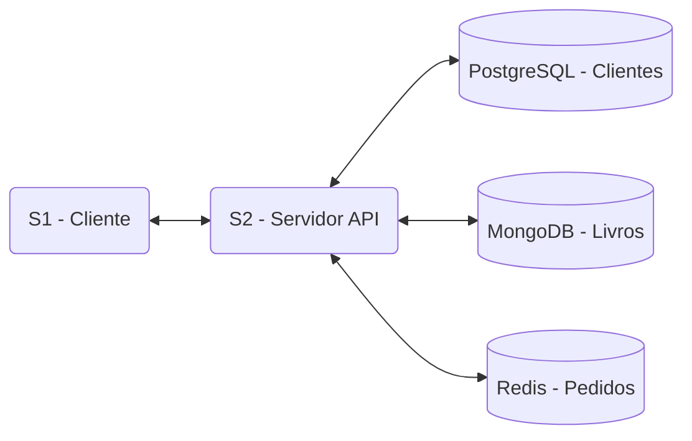

# 📚 Projeto Livros & Dados – Polyglot Persistence (2.0)

Este projeto implementa uma **livraria online** utilizando o padrão **Polyglot Persistence**, onde diferentes tipos de dados são armazenados em bancos de dados distintos, escolhidos conforme a natureza e o uso de cada dado. A arquitetura é baseada em comunicação direta entre serviços (Cliente-Servidor).

O sistema envolve dois serviços principais e três bancos de dados:

* **S1 (Cliente):** Gera dados e faz requisições para o serviço S2.
* **S2 (Servidor):** Recebe as requisições, processa e armazena/consulta os dados nos bancos apropriados.
* **Bancos de Dados:**
    * **Clientes** (informações cadastrais)
    * **Livros** (catálogo de produtos)
    * **Pedidos** (histórico de compras)

## 🧩 Arquitetura e Funcionamento

O sistema segue o modelo Cliente-Servidor, onde S1 faz requisições HTTP para S2.



1.  **S1 – Cliente (`client.py`)**
    * Gera dados fictícios de **Clientes** (usando a biblioteca Faker), busca dados de **Livros** na API do Google Books e cria **Pedidos** associando clientes e livros.
    * Envia esses dados via requisições HTTP (POST) para o serviço S2.
    * Armazena um log detalhado de cada requisição enviada e da resposta recebida de S2 no arquivo `s1_log.json` para fins de auditoria e verificação.

2.  **S2 – Servidor (`server.py`)**
    * É uma API REST (construída com Flask) que expõe endpoints para manipular clientes, livros e pedidos.
    * Recebe as requisições de S1 e direciona os dados para o banco de dados correto:
        * Requisições sobre clientes são persistidas no **PostgreSQL**.
        * Requisições sobre livros são persistidas no **MongoDB**.
        * Requisições sobre pedidos são persistidas no **Redis**.
    * Retorna respostas em formato JSON para S1, confirmando o sucesso ou informando sobre erros.

## ✏️ Tema e Justificativa dos Bancos

### 1. Tema: Livraria Online

O sistema gerencia três entidades principais com características distintas:

* **Clientes:** Dados estruturados com campos fixos (ID, nome, e-mail).
* **Livros:** Dados semiestruturados vindos de uma fonte externa (API), com campos que podem variar (ex: alguns livros podem não ter ISBN ou múltiplos autores).
* **Pedidos:** Dados de acesso rápido, representando uma ação transacional (a compra de um livro por um cliente).

Essa diversidade justifica o uso de **Polyglot Persistence**.

### 2. Escolha dos Bancos de Dados

| Banco          | Tipo                   | Dado Armazenado | Justificativa                                                                                             |
| :------------- | :--------------------- | :-------------- | :-------------------------------------------------------------------------------------------------------- |
| **PostgreSQL** | Relacional (RDB)       | Clientes        | Ideal para dados cadastrais estruturados. Garante consistência, integridade e a possibilidade de relacionamentos futuros (ex: endereços). |
| **MongoDB** | Document Store (NoSQL) | Livros          | Perfeito para armazenar dados em formato JSON. Sua flexibilidade acomoda a estrutura variável dos dados de livros vindos da API do Google Books. |
| **Redis** | Key-Value (NoSQL)      | Pedidos         | Excelente para dados que precisam de alta velocidade de escrita e leitura. Armazena os pedidos de forma simples e rápida, ideal para consulta de histórico recente. |

### 3. Implementação do S2

O serviço S2 foi implementado como um **serviço monolítico com roteamento interno**. Ele centraliza toda a lógica de negócio e persistência em uma única API, facilitando a implantação e o desenvolvimento para este escopo de projeto. Cada endpoint da API é responsável por interagir com o banco de dados correspondente.

## ⚙️ Pré-requisitos

* **Docker Desktop** (com Docker Compose)
* **Python 3.11+**
* **pip**

## 🔧 Instalação e Configuração

1.  **Clone o repositório**
    ```bash
    git clone <URL_DO_SEU_REPOSITORIO>
    cd <NOME_DA_PASTA>
    ```

2.  **Variáveis de Ambiente**
    * O arquivo `.env` já contém a chave da **Google Books API** e as configurações padrão dos bancos. Se necessário, ajuste as portas ou senhas.

3.  **Instale as dependências Python**
    ```bash
    pip install -r requirements.txt
    ```

4.  **Inicie os containers dos bancos de dados**
    ```bash
    docker-compose up -d
    ```
    Este comando irá iniciar os containers do PostgreSQL, MongoDB e Redis em segundo plano.

## 🚀 Execução

Para rodar o projeto, você precisará de **dois terminais** abertos no diretório raiz do projeto.

1.  **Terminal 1 – Inicie o Servidor (S2)**
    ```bash
    python services/s2_server/server.py
    ```
    Você verá a confirmação de que o servidor Flask está rodando.

2.  **Terminal 2 – Inicie o Cliente (S1)**
    ```bash
    python services/s1_client/client.py
    ```
    O cliente começará a gerar dados e a enviar requisições para o servidor S2. Você verá os logs de envio no terminal.

**Para verificar:**
* **Logs do S1:** Abra o arquivo `s1_log.json` para ver o histórico completo de requisições e respostas.
* **Logs do S2:** O terminal onde S2 está rodando mostrará as requisições que chegam (ex: `POST /customers 201 -`).
* **Bancos de Dados:** Você pode usar ferramentas como DBeaver (para PostgreSQL), MongoDB Compass ou o Redis CLI para verificar se os dados estão sendo salvos corretamente.

## 🛑 Parar e Limpar

Para parar a execução e remover os containers, redes e volumes criados pelo Docker Compose, execute:

```bash
docker-compose down --volumes
```